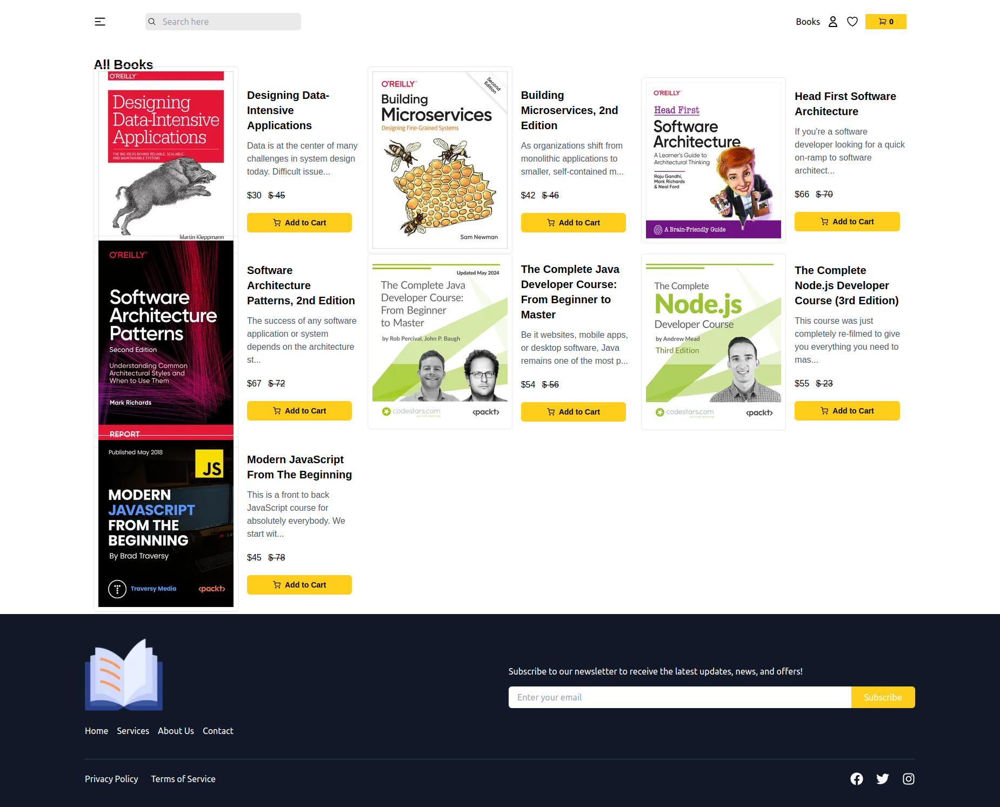
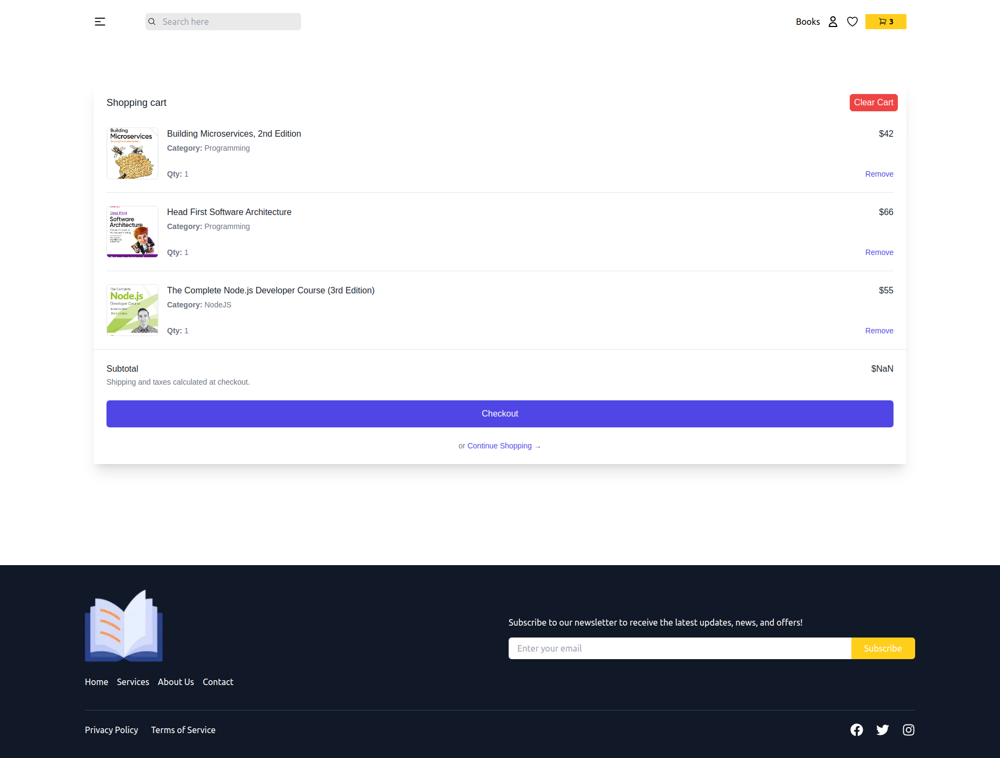
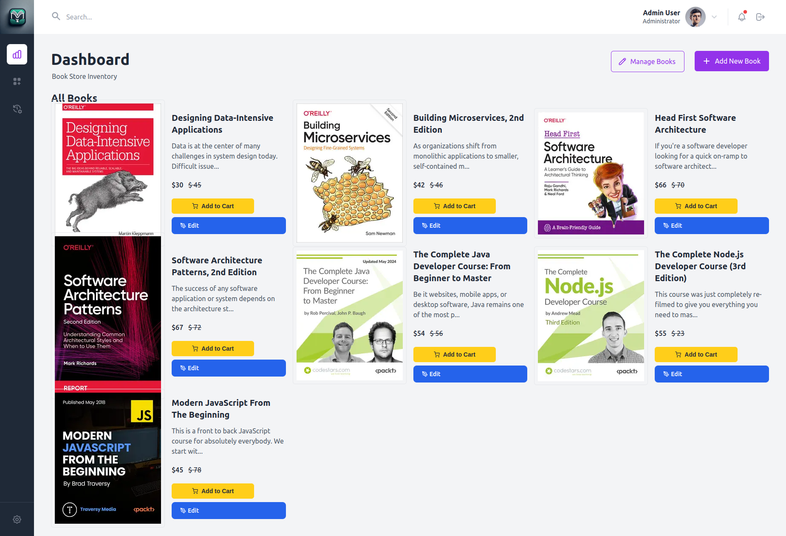

# Book Store

This is a full-stack book store application built with Go for the backend and Next.js for the frontend.

## Features

- User authentication and authorization
- Admin dashboard for managing books and orders
- Goroutine practice
- JWT token generation with custom claims
- CRUD operations for books and orders
- Middleware for request validation and logging
- Responsive UI with React and Next.js
- State management with Redux Toolkit

## Tech Stack

### Backend

- **Go**: Programming language for the backend
- **Gin**: Web framework for building the API
- **GORM**: ORM library for database interactions
- **JWT**: JSON Web Tokens for authentication
- **Slog**: Structured logging

### Frontend

- **Next.js**: React framework for server-side rendering and static site generation
- **React**: JavaScript library for building user interfaces
- **Redux Toolkit**: State management
- **TypeScript**: Typed superset of JavaScript
- **ESLint**: Linting tool for code quality

## Screenshots

### Home Page


### Books Page


### Cart Page


### Admin dashboard


## Getting Started

### Backend

1. Navigate to the backend directory:
    ```bash
    cd backend
    ```

2. Install dependencies:
    ```bash
    go mod tidy
    ```

3. Run the server:
    ```bash
    go run main.go
    ```

### Frontend

1. Navigate to the frontend directory:
    ```bash
    cd frontend
    ```

2. Install dependencies:
    ```bash
    npm install
    ```

3. Run the development server:
    ```bash
    npm run dev
    # or
    yarn dev
    # or
    pnpm dev
    # or
    bun dev
    ```

4. Open [http://localhost:3000](http://localhost:3000) with your browser to see the result.

## Learn More

To learn more about the technologies used in this project, take a look at the following resources:

- [Go Documentation](https://golang.org/doc/)
- [Gin Documentation](https://gin-gonic.com/docs/)
- [Next.js Documentation](https://nextjs.org/docs)
- [React Documentation](https://reactjs.org/docs/getting-started.html)
- [Redux Toolkit Documentation](https://redux-toolkit.js.org/introduction/getting-started)

## License

This project is licensed under the MIT License.